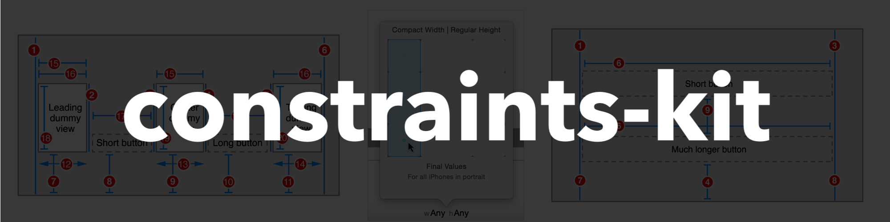

# constraints-kit [](https://github.com/sindresorhus/awesome)

[]()
[]()
[]()
[]()

**Last Update: 02/January/2020.**



### If you like the project, please give it a star ⭐ It will show the creator your appreciation and help others to discover the repo.

# ✍️ About 
🏗 Declarative, Chainable & Lightweight Auto Layout constraints framework for iOS. The framework offers a rich set of methods for defining `Auto Layout` constraints (see `Contents`) without any other external dependencies. 

# 💡 Movitation
The purpose of this framework is to provide a very lightweight solution for `Auto Layout` and to make the development of programmatic `UI` much simpler, hiding the boilerplate code under the framework. Primary usage is for internal developments, however I decided to share the framework with the community, since it offers some uniqueness and I'm going to continue work on this development. 

# 📺 Demo

In order to create something like in the following screenshot:


You need to write just a few lines of code:

```swift
// 1. First you need to add all your views somewhere. That means your views must have a superview. Let's assume that you have done that. 

// 2. Then we assume that visually your views are fully configured. 

// 3. And finally, all we need to do is to specify the constraints:

cardView.pinInside(view: self.view, offset: 16)

imageView.pinInside(view: cardView, offset: 8)

blurView.pinInside(view: cardView)
    
titleLabel.pinTopToTopCenter(of: imageView, offset: 24)
    
button
        .bottom(with:   imageView, anchor:  .bottom,    offset: -34)
        .center(in:     imageView, axis:    .horizontal)
        .set(height:    60)
        .set(aspect:    2/1)
            
label
        .center(in:     imageView)
        .left(with:     imageView, anchor: .left,   offset:  16)
        .right(with:    imageView, anchor: .right,  offset: -16)
```

# 🏗 Installation

## Swift Package Manager

### Xcode 11+

1. Open `MenuBar` → `File` → `Swift Packages` → `Add Package Dependency...`
2. Paste the package repository url `https://github.com/jVirus/constraints-kit` and hit `Next`.
3. Select the installment rules.

After specifying which version do you want to install, the package will be downloaded and attached to your project. 

### Package.swift
If you already have a `Package.swift` or you are building your own package simply add a new dependency:

```swift
dependencies: [
    .package(url: "`https://github.com/jVirus/constraints-kit", from: "1.0.0")
]
```

## Manual 
You can always use copy-paste the sources method 😄. Or you can compile the framework and include it with your project.


# ✈️ Usage
The framework is pretty easy to use, however I do recommend to learn the basics of `Auto Layout` before installing the framework - it will help you to understand what the minimum number of constraints a `UIView` needs to have and to avoid common pitfalls.

#### Import 
After adding the framework to a project, simply add an import statemt:

```swift
import ConstraintsKit
```

#### Setting size 

```swift
view.set(size: CGSize(width: 300, height: 300))
```

```swift
view.set(width: 400)
```

```swift
view.set(height: 200)
```

```swift
view
    .set(width:  200)
    .set(aspect: 2/1)
```

#### Constraining

A `UIImageView` fills the parent `UIView` with offset, until the bottom anchor reaches the `top` anchor of the `UIButton`:

```swift
imageView
    .constrain(using: .top,     to: .top,   of: view,   offset:  24)
    .constrain(using: .right,   to: .right, of: view,   offset: -24)
    .constrain(using: .left,    to: .left,  of: view,   offset:  24)
    .constrain(using: .bottom,  to: .top,   of: button, offset: -24)
```

Also you can remove the `of: view` part in cases when you want to anchor a `view` to its `superview`:
```swift
imageView
    .constrain(using: .top,     to: .top, ,   offset:  24)
    .constrain(using: .right,   to: .right,   offset: -24)
    .constrain(using: .left,    to: .left,    offset:  24)
    .constrain(using: .bottom,  to: .top,     offset: -24)
```

A `UIImageView` is anchored at the center of the parent view, it's stretched to the `horizontal` axis by anchoring `left` & `right` sides with the `aspect ratio` of `3 to 2`:

```swift
imageView
    .center(in:   view, axis:   .vertical)
    .left(with:   view, anchor: .left)
    .right(with:  view, anchor: .right)
    .set(aspect: 3/2)
```

#### Anchoring

A custom `UIView` fills a `UICollectionViewCell` to the `top` system spacing, with custom `left` & `right` offsets and to the `top` anchor of the `UIButton`:

```swift
presenterView
    .topToSystemSpacing(with: view,   anchor: .top)
    .right(             with: view,   anchor: .right, offset: -16)
    .left(              with: view,   anchor: .left,  offset:  16)
    .bottom(            with: button, anchor: .top,   offset: -16)
```

A `UIButton` is placed at the `center` of the parent view, its `bottom` anchor is attached to the bottom of the parent view, `height` is set to `60` with `aspect ratio` of `2 to 1`:

```swift
button
    .bottom(with: imageView, anchor:  .bottom,    offset: -34)
    .center(in:   imageView, axis:    .horizontal)
    .set(height: 60)
    .set(aspect: 2/1)
```

#### Pinning 

A custom `ActivityIndicator` view is anchored to the top left corner of the specified view with some `offset` and `size` equals to `20 to 20`:

```swift
activityIndicator
    .pinInsideToTopLeftCorner(of: view, offset: 24)
    .size(CGSize(width: 20, height: 20))
```

Advanced case where top left anchor of a custom `ProgressView` is attached to the top leading corner of the parent view and  the bottom right anchor is attached to the top right anchor of the `LogIn` button:

```swift
progressView
    .pin(anchors: [.left,   .top],    toTargetView: view,   using: [.leading, .top])
    .pin(anchors: [.bottom, .right],  toTargetView: button, using: [.right,   .top])
```

### Filling

A `UITableView` is placed inside the parent `UIView` and fills the top half of it (using `left`, `top`, `right` and `centerX` anchors):

```swift
tableView.fillTopHalf(of: parentView)
```

A `UICollectionView` is placed inside the parent `UIView` and fills the left half of it with the specified offset (using `left`, `top`, `bottom` and `centerY` anchors):

```swift 
collectionView.fillLeftHalf(of: splitView, offset: 16)
```


# 📝 Contents 
The kit contains several groups of methods, each with a specific purpose. All the groups can be chained together, however you should keep in mind that if you have conflicting constraints or you don't provide enough information for the `Auto Layout` engine, you will see no effect or some unexpected results. It's assumed that you already know the basics of `Auto Layout`.

#### Common 

- `constrain` - constrains `self` using the specified `Attribute` to the specified `Attribute` with respect to the related `UIView`. You may set `Relation` (which is by default `.equal`), `offset` (default is `0.0`) and `multiplier` (default is `1.0`)
- `fit` - places `self` inside the specified `UIView` with an optional `offset` (default is `0.0`)
- `center` - centers `self` inside the specified `UIView` using a concrete `Axis` case, with an optional `multiplier` (default is `1.0`)
- `width` - applies width equalization between `self` and the specified `UIView`. You may change the `Relation` (default is `equal`), `UILayoutPriority` (default is `required`), `multiplier` (default is `1.0`) and `constant` (default is `0.0`)
- `height` - applies height equalization between `self` and the specified `UIView`. You may change the `Relation` (default is `equal`), `UILayoutPriority` (default is `required`), `multiplier` (default is `1.0`) and `constant` (default is `0.0`)

#### Setters

- `set(size:)` - sets a new `CGSize` for `self` by applying layout constaints for `width` & `height` anchors
- `set(width:)` - sets a new `width` by applying layout constaint for `width` anchor
- `set(height:)` - sets a new `height` by applying layout constraint for `height` anchor
- `set(aspect:)` - sets a new `aspect ratio` by applying layout constaint for `aspect` anchor
- `set(aspectOf:)` - sets a new `aspect ratio` by duplicating `aspect` of the specified `UIView`
- `set(value: to:)` - sets a new offset `value` for the `Attribute`

#### Anchoring

- `top` - anchors top anchor to the specified `UIView` using `AxisY` anchor, `Relation` (defatul is `.equal`), NSLayoutPriority (default is `.required`) and `offset` (default is `0.0`)
- `bottom` - anchors bottom anchor to the specified `UIView` using `AxisY` anchor, `Relation` (defatul is `.equal`), NSLayoutPriority (default is `.required`) and `offset` (default is `0.0`)
- `left` - anchors left anchor to the specified `UIView` using `AxisY` anchor, `Relation` (defatul is `.equal`), NSLayoutPriority (default is `.required`) and `offset` (default is `0.0`) 
- `right` - anchors right anchor to the specified `UIView` using `AxisY` anchor, `Relation` (defatul is `.equal`), NSLayoutPriority (default is `.required`) and `offset` (default is `0.0`)

#### Anchoring to System Spacing

- `rightToSystemSpacing` - anchors right anchor to the specified `UIView` with respect to System Spacing using `AxisY` anchor, `Relation` (defatul is `.equal`), NSLayoutPriority (default is `.required`) and `offset` (default is `0.0`)
- `leftToSystemSpacing` - anchors left anchor to the specified `UIView` with respect to System Spacing using `AxisY` anchor, `Relation` (defatul is `.equal`), NSLayoutPriority (default is `.required`) and `offset` (default is `0.0`)
- `topToSystemSpacing` - anchors top anchor to the specified `UIView` with respect to System Spacing using `AxisY` anchor, `Relation` (defatul is `.equal`), NSLayoutPriority (default is `.required`) and `offset` (default is `0.0`)
- `bottomToSystemSpacing` - anchors bottom anchor to the specified `UIView` with respect to System Spacing using `AxisY` anchor, `Relation` (defatul is `.equal`), NSLayoutPriority (default is `.required`) and `offset` (default is `0.0`)

#### Pinning

- `pinTopLeftToTopLeftCorner` - pins Top Left anchor to the Top Left corner of the specified `UIView` with a given `offset` (default is `0.0`)
- `pinTopRightToTopRightCorner` - pins Top Right anchor to the Top Right corner of the specified `UIView` with a given `offset` (default is `0.0`)
- `pinBottomRightToBottomRight` - pins Bottom Right anchor to the Bottom Right corner of the specified `UIView` with a given `offset` (default is `0.0`)
- `pinBottomLeftToBottomLeft` - pins Bottom Left anchor to the Bottom Left corner of the specified `UIView` with a given `offset` (default is `0.0`)
- `pinBottomRightToTopLeft` - pins Bottom Right anchor to the Top Left corner of the specified `UIView` with a given `offset` (default is `0.0`)
- `pinBottomLeftToTopRight` - pins Bottom Left anchor to the Top Right corner of the specified `UIView` with a given `offset` (default is `0.0`)
- `pinTopLeftToBottomRight` - pins Top Left anchor to the Bottom Right corner of the specified `UIView` with a given `offset` (default is `0.0`)
- `pinBottomRightToTopLeft` - pins Bottom Right anchor to the Top Left corner of the specified `UIView` with a given `offset` (default is `0.0`)
- `pinTopToTopCenter` - pins Top anchor to the Top Center anchor of the specified `UIView` with a given `offset` (default is `0.0`)
- `pinBottomToBottomCenter` - pins Bottom anchor to the Bottom Center anchor of the specified `UIView` with a given `offset` (default is `0.0`)
- `pinLeftToLeftCenter` - pins Left anchor to the Left Center anchor of the specified `UIView` with a given `offset` (default is `0.0`)
- `pinRightToRightCenter` - pins Right anchor to the Right Center anchor of the specified `UIView` with a given `offset` (default is `0.0`)
- `pinInside` - pins `self` inside the specified `UIView` with `Relation` (default is `.equal`), UILayoutPriority (default is `.required`) and `offset` (default is `0.0`)
- `pinTo` - pins `self` to the specified `UIView` by using `Anchor` (which is an `OptionSet`)
- `pin(anchors:, toTargetView: , using:)` - pins the specified `Anchors` of `self` to the `UIView` by using the related `Anchors`

#### Filling

- `fillBottomHalf` - fills the bottom half of the specified view by `self` with the given `offset` (default is `0.0`)
- `fillTopHalf` - fills the top half of the specified view by `self` with the given `offset` (default is `0.0`)
- `fillLeftHalf` - fills the left half of the specified view by `self` with the given `offset` (default is `0.0`)
- `fillRightHalf` - fills the right half of the specified view by `self` with the given `offset` (default is `0.0`)

# 👨‍💻 Author 
[Astemir Eleev](https://github.com/jVirus)

# 🔖 Licence 
The project is available under [MIT Licence](https://github.com/jVirus/collection-flow-layout-ios/blob/master/LICENSE)
